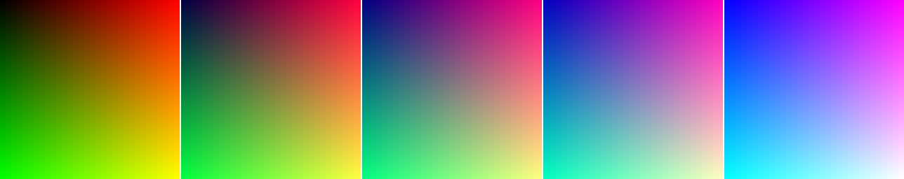

# WEEKEND-RAYTRACER

This work implements an N-dimensional version of Peter Shirley's, Trevor David Black's, and Steve Hollasch's
raytracer from their [Raytracing in One Weekend Book Series][book].

  [book]: https://raytracing.github.io/books/RayTracingInOneWeekend.html

## Examples

### 1.2.2: Book 1, Chapter 2, Section 2: Creating an Image File

This implementation outputs PNG files rather than PPM files.
Additionally, it supports outputting (N-1)-dimensional image cubes and
interleaving the various slices with borders between them.

You can output an image akin to Book 1, Chapter 2, Section 2's image
with the following function:

    (weekend-raytracer/examples:b1c2-2image &optional verticalp)

The image here is a 3-D image cube rendered as horizontal slices of
constant blueness (or as vertical slices of constant blueness if
`VERTICALP` is non-`NIL`). The first slice is identical to the
book image.
