# WEEKEND-RAYTRACER

This work implements an N-dimensional version of Peter Shirley's, Trevor David Black's, and Steve Hollasch's
raytracer from their [Raytracing in One Weekend Book Series][book].

  [book]: https://raytracing.github.io/books/RayTracingInOneWeekend.html

## Examples

Caveat: There are some functions that change/improve over the course of the book.
Some of the images below will look different if rendered with newer versions
of the software.

All images up to section 1.9.1 should be generate-able with this
software at revision `vB1C8`.

### 1.2.2: Book 1, Chapter 2, Section 2: Creating an Image File

This implementation outputs PNG files rather than PPM files.
Additionally, it supports outputting (N-1)-dimensional image cubes and
interleaving the various slices with borders between them.

You can output an image akin to Book 1, Chapter 2, Section 2's image
with the following function:

    (weekend-raytracer/examples:b1c2-2image &optional verticalp)

The image here is a 3-D image cube rendered as horizontal slices of
constant blueness (or as vertical slices of constant blueness if
`VERTICALP` is non-`NIL`). The first slice is identical to the
book image.

### 1.4.2: Book 1, Chapter 4, Section 2: Creating an Image File

The book image here renders an interpolation between blue and
white. This image renders between blue and white but also between
orange and the color the book would render.

You can output an image akin to Book 1, Chapter 4, Section 2's image
with the following function:

    (weekend-raytracer/examples:b1c4-2image &optional verticalp)

The image here is a 3-D image cube rendered as horizontal slices.
The color of each pixel is based on the 3rd and 4th coordinates
of the camera ray's direction.

### 1.5.2: Book 1, Chapter 5, Section 2: Creating Our First Raytraced Image

The book image here renders an interpolation between blue and
white with a red sphere in the center of the view.

The book has the image plane in the negative-z direction and
then uses x and y for coordinates within the image square.

For maximum utility when changing number of dimensions, this
code puts the image plane in the negative-x direction and
then uses y, z, and w to move around the image cube.

I have moved the sphere slightly in the w direction.

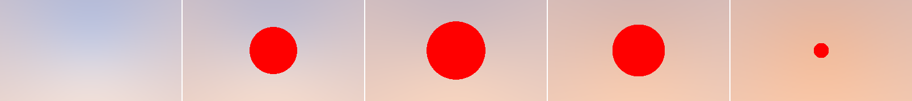

You can output an image akin to Book 1, Chapter 5, Section 2's image
with the following function:

    (weekend-raytracer/examples:b1c5-2image &optional verticalp)

The image here is a 3-D image cube rendered as horizontal slices.
The color of each pixel is based on the 3rd and 4th coordinates
of the camera ray's direction except where the ray intersects the
sphere. Where the ray intersects the sphere, the image is solid red.

### 1.6.1: Book 1, Chapter 6, Section 1: Shading With Surface Normals

The book image here renders an interpolation between blue and
white with a sphere in the center of the view.
The colors on the sphere are a function of the normal on the
sphere at the point of intersection.

The book has the image plane in the negative-z direction and
then uses x and y for coordinates within the image square.

For maximum utility when changing number of dimensions, this
code puts the image plane in the negative-x direction and
then uses y, z, and w to move around the image cube.

I have moved the sphere slightly in the w direction.

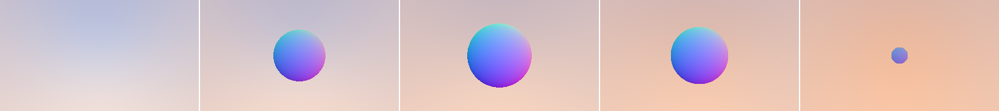

You can output an image akin to Book 1, Chapter 6, Section 1's image
with the following function:

    (weekend-raytracer/examples:b1c6-1image &optional verticalp)

The image here is a 3-D image cube rendered as horizontal slices.
The color of each pixel is based on the 3rd and 4th coordinates
of the camera ray's direction except where the ray intersects the
sphere. Where the ray intersects the sphere, the color is

    r = (/ (1+ (vref normal 1)) 2)
    g = (/ (1+ (vref normal 2)) 2)
    b = (/ (1+ (vref normal 0)) 2)

### 1.6.1: Book 1, Chapter 6, Section 7: Common Constants And Utility Functions

The book image here renders an interpolation between blue and
white with a sphere in the center of the view and another sphere as the ground.
The colors on the sphere are a function of the normal on the
sphere at the point of intersection.

The book has the image plane in the negative-z direction and
then uses x and y for coordinates within the image square.

For maximum utility when changing number of dimensions, this
code puts the image plane in the negative-x direction and
then uses y, z, and w to move around the image cube.

I have moved both spheres slightly in the w direction.

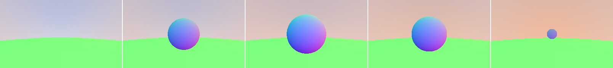

You can output an image akin to Book 1, Chapter 6, Section 7's image
with the following function:

    (weekend-raytracer/examples:b1c6-7image &optional verticalp)

The image here is a 3-D image cube rendered as horizontal slices.
The color of each pixel is based on the 3rd and 4th coordinates
of the camera ray's direction except where the ray intersects the
sphere. Where the ray intersects the spheres, the color is

    r = (/ (1+ (vref normal 1)) 2)
    g = (/ (1+ (vref normal 2)) 2)
    b = (/ (1+ (vref normal 0)) 2)

### 1.7.1: Book 1, Chapter 7, Section 1: Moving Camera Code Into Its Own Class

This is essentially the same as image 1.6.7 above.
The difference here is that the camera is moved into its own class.
The sky color is also not being LERP-ed at the moment as a function
of the normal to simplify allowing the camera to take in arbitrary
numbers of spatial and color dimensions.

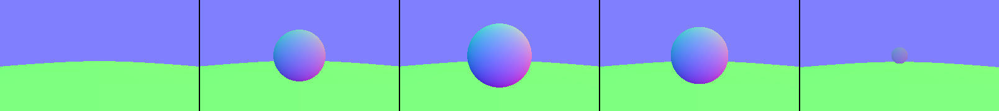

Note: this requires version `vB1C8` or lower of the camera to render as depicted here.

You can generate this image with the following function:

    (weekend-raytracer/examples:b1c7-1image &optional verticalp)

The image here is a 3-D image cube rendered as horizontal slices.
The color of each pixel is the default sky color except where the ray
intersects the sphere.
Where the ray intersects the spheres, the color is

    r = (/ (1+ (vref normal 1)) 2)
    g = (/ (1+ (vref normal 2)) 2)
    b = (/ (1+ (vref normal 0)) 2)

### 1.8.2: Book 1, Chapter 8, Section 2: Generating Pixels With Multiple Samples

This is essentially the same as image 1.7.1 above except with anti-aliasing.

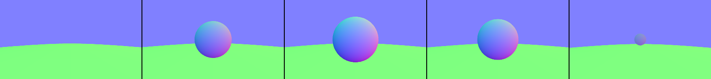

You can generate this image with the following function:

    (weekend-raytracer/examples:b1c8-2image samples-per-pixel &optional verticalp)

Note: this requires version `vB1C8` of the camera to render as depicted here.

The current anti-aliasing takes the aspect ratios into consideration when
deciding how far to stray from the center ray of a pixel.
Without this, the fact that some axises have hundreds of pixels along them
and others only have a few pixels along them
means that pixel cubes are really-long along some axises
making it a great deal easier to hit or miss objects in some directions.
That results in very fuzzy edges unless you bump the number of samples up by many orders of magnitude.

This means the simulated camera has roughly (hyper)cubical sensors at each pixel
but that the pixels are spaced out more on axises where there are fewer pixels per degree of view.

### 1.9.1: Book 1, Chapter 9, Section 1: A Simple Diffuse Material

This is essentially the same as image 1.7.1 above except that it uses rays
bounced off of the object to contribute to the object's color. The objects
here are assumed to be gray objects with the bluish sky color cast upon
them.

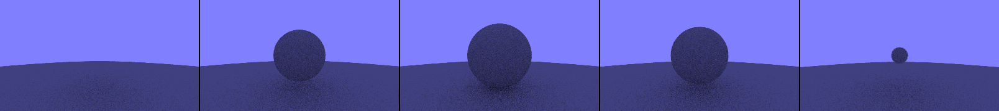

You can generate this image with the following function:

    (weekend-raytracer/examples:b1c9-7image samples-per-pixel &optional verticalp)

Note: this requires version `vB1C9S3` of the camera to render as depicted here.

I have chosen a different method of creating random unit vectors as the rejection
approach in the book rejects more often as the dimensions increase.

### 1.9.2: Book 1, Chapter 9, Section 2: Limiting the Number of Child Rays

The image rendered above in section 1.9.1 is no different than this.
This just limits the depth of recursion.

### 1.9.3: Book 1, Chapter 9, Section 3: Fixing Shadow Acne

The image rendered above in section 1.9.1 already included this mechanism.

### 1.9.4: Book 1, Chapter 9, Section 4: True Lambertian Reflection

This is essentially the same as image 1.9.1 above except that it uses
true Lambertian reflection.

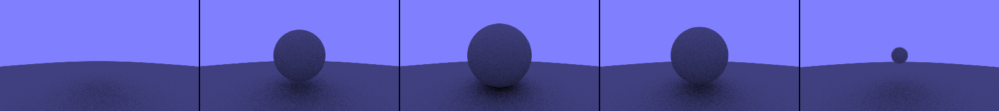

You can generate this image with the following function:

    (weekend-raytracer/examples:b1c9-10image samples-per-pixel &optional verticalp)

### 1.9.5: Book 1, Chapter 9, Section 5: Using Gamma Correction for Accurate Color Intensity

This is essentially the same as image 1.9.4 above except that it uses gamma correction
to compensate for the otherwise linearity in darkness.

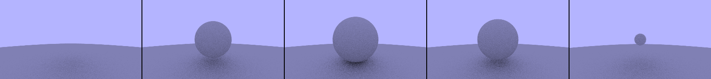

You can generate this image with the following function:

    (weekend-raytracer/examples:b1c9-12image samples-per-pixel &optional verticalp)

### 1.10.5: Book 1, Chapter 10, Section 5: Mirrored Light Reflection

This image contains a large yellow sphere for the ground (which ends up looking
green because of the color of the sky), a small, diffuse blue sphere centered in the
view (except offset slightly in the w-direction), and two mirrored spheres
with slightly different albedos and different w-direction offsets.

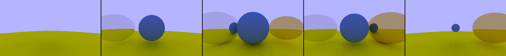

You can generate this image with the following function:

    (weekend-raytracer/examples:b1c10-13image samples-per-pixel &optional verticalp)

Note: this requires `vB1C10S5`.

### 1.10.6: Book 1, Chapter 10, Section 6: Fuzzy Reflection

This image contains a large yellow sphere for the ground (which ends up looking
green because of the color of the sky); a small, diffuse blue sphere centered in the
view (except offset slightly in the w-direction); and two mirrored spheres
with slightly different albedos, different fuzziness, and different w-direction offsets.

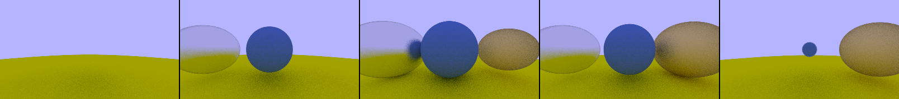

You can generate this image with the following function:

    (weekend-raytracer/examples:b1c10-14image samples-per-pixel &optional verticalp)

Note: this requires `vB1C10`.

### 1.11.2: Book 1, Chapter 11, Section 2: Snell's Law

This image contains a large yellow sphere for the ground (which ends up looking
green because of the color of the sky); a small, diffuse blue sphere centered in the
view (except offset slightly in the w-direction); a fuzzily mirrored sphere on the
right, and a refracting sphere on the left.

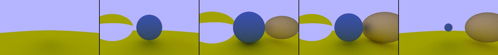

You can generate this image with the following function:

    (weekend-raytracer/examples:b1c11-16image samples-per-pixel &optional verticalp)

Something that has been showing up in the images since 1.9.4 is that you can clearly
see how the sphere blocks ambient light even in slices where the sphere is not
present at all like in the leftmost frame here or when the visible portion of the
sphere is very small compared to the shadow the sphere is casting as in the rightmost
frame here.

Note: this requires `vB1C11S2`.

### 1.11.2: Book 1, Chapter 11, Section 3: Total Internal Reflection

This image contains a large yellow sphere for the ground (which ends up looking
green because of the color of the sky); a small, diffuse blue sphere centered in the
view (except offset slightly in the w-direction); a fuzzily mirrored sphere on the
right, and a refracting sphere on the left. The refracting sphere has an index of
refraction less than that of the air and so is mostly reflecting.

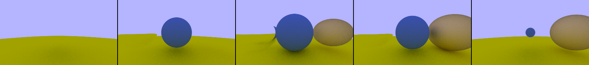

You can generate this image with the following function:

    (weekend-raytracer/examples:b1c11-17image samples-per-pixel &optional verticalp)

Note: this requires `vB1C11S3`.

### 1.11.2: Book 1, Chapter 11, Section 5: Modelling A Hollow Sphere

This image contains a large yellow sphere for the ground (which ends up looking
green because of the color of the sky); a small, diffuse blue sphere centered in the
view (except offset slightly in the w-direction); a fuzzily mirrored sphere on the
right, and a refracting sphere on the left. The refracting sphere is hollow.

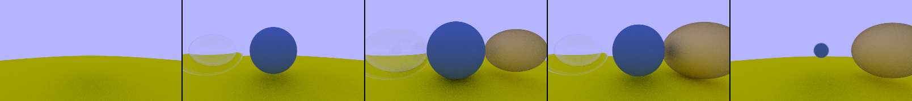

You can generate this image with the following function:

    (weekend-raytracer/examples:b1c11-18image samples-per-pixel &optional verticalp)

Note: this requires `vB1C11`.

### 1.12.1: Book 1, Chapter 12, Section 1: Camera Viewing Geometry

This image contains two spheres which should take up the entire
vertical field of view when the field of view is 90-degrees.

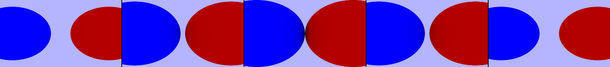

You can generate this image with the following function:

    (weekend-raytracer/examples:b1c12-19image samples-per-pixel &optional verticalp)

### 1.12.2: Book 1, Chapter 12, Section 2: Positioning and Orienting the Camera

These images contain a large yellow sphere for the ground (which ends up looking
green because of the color of the sky); a small, diffuse blue sphere centered in the
view (except offset slightly in the w-direction); a fuzzily mirrored sphere on the
right, and a refracting sphere on the left. The refracting sphere is hollow.

This is the image with a 90-degree field of view:

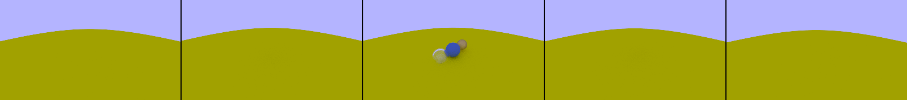

You can generate this image with the following function:

    (weekend-raytracer/examples:b1c12-20image samples-per-pixel &optional verticalp)

This is the image with a 20-degree field of view:

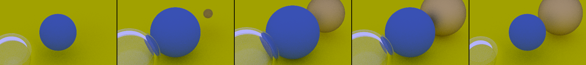

You can generate this image with the following function:

    (weekend-raytracer/examples:b1c12-21image samples-per-pixel &optional verticalp)

### 1.13.2: Book 1, Chapter 13: Defocus Blur

These images contain a large yellow sphere for the ground (which ends up looking
green because of the color of the sky); a small, diffuse blue sphere centered in the
view (except offset slightly in the w-direction); a fuzzily mirrored sphere on the
right, and a refracting sphere on the left. The refracting sphere is hollow.

You can generate this image with the following function:

    (weekend-raytracer/examples:b1c12-22image samples-per-pixel &optional verticalp)

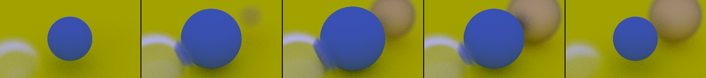
